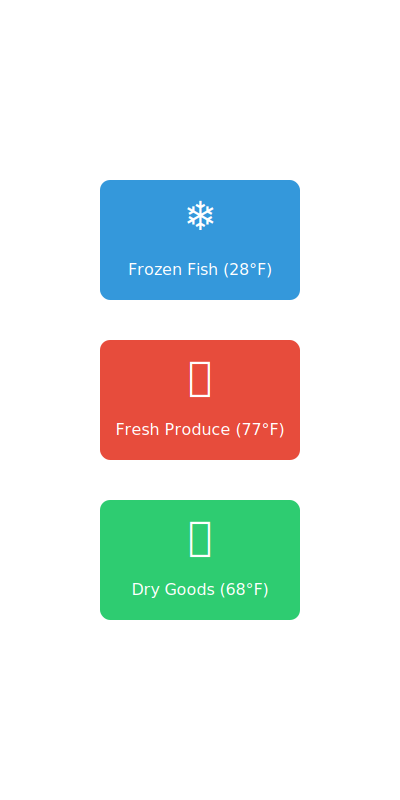

  <h1 class="text-6xl">Containerize your development environment</h1>
  
Joey Hage

  
January 22, 2024

---

# Common development challenges

  <ul>
    <li>Different software versions across team members</li>
    <li>Complex tech stacks with conflicting dependencies</li>
    <li>Staging environments that don't match production and/or waiting for staging environments to free up</li>
    <li>Time spent debugging environment issues instead of coding</li>
    <li>Integration testing requires complex setup</li>
  </ul>

---

# What is a container?

  
Think of shipping containers in global trade:

  <ul>
    <li>Before containers: Loose cargo, different sizes, loading challenges</li>
    <li>After containers: Standardized boxes that work everywhere</li>
  </ul>

  
Just like shipping containers revolutionized transport:

  <ul>
    <li>A software container packages everything your app needs</li>
    <li>Works the same way everywhere - your laptop, the cloud, any server</li>
    <li>No more "it works on my machine" problems</li>
  </ul>

---

# Container isolation

  
When shipping containers are used:

  <ul>
    <li>Fish and bananas can travel on the same ship without mixing</li>
    <li>Each container controls its own temperature and environment</li>
    <li>One leaky container doesn't affect the others</li>
  </ul>

  
Software containers work the same way:

  <ul>
    <li>Each app runs in its own isolated space</li>
    <li>Different versions of Python, Node, or Java can run side by side</li>
    <li>If one container crashes, others keep running</li>
  </ul>

---

# Solution: Containerize your development environment

  <ul>
    <li>New developers and contractors are productive on day one - no more multi-day setup</li>
    <li>Switch between projects without dependency conflicts</li>
    <li>Share consistent development environments via version control</li>
    <li>Run integration tests locally using dependencies such as databases and queues without affecting test environments</li>
    <li>Troubleshoot production issues by running the same service(s) locally</li>
  </ul>

---

# Live Demo

  
We'll create a development environment for a typical web application:

  <ul>
    <li>Set up a Python backend using Postgres and a message queue</li>
    <li>Set up a Vue frontend</li>
    <li>Configure VS Code Dev Container using Docker Compose</li>
    <li>Show how to handle multiple projects</li>
  </ul>

---

# Best practices

  <ul>
    <li>Document any required environment variables</li>
    <li>Include common development tools in your dev container</li>
    <li>Use compose for multi-container development environments</li>
  </ul>

---

  <h1 class="text-6xl">Questions?</h1>

